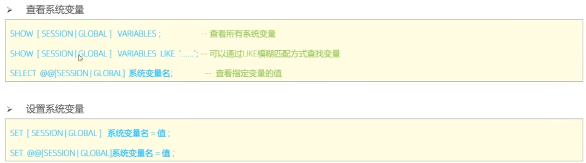
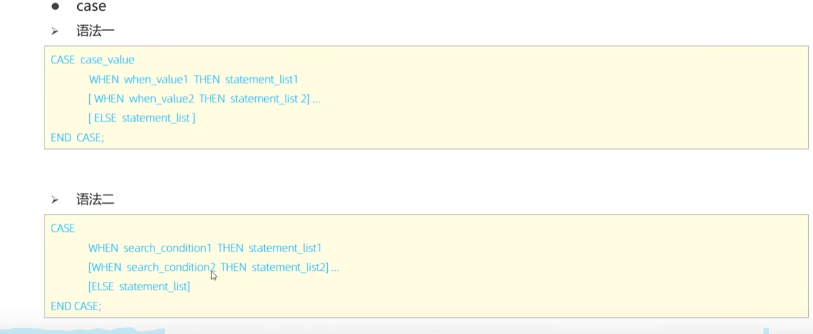
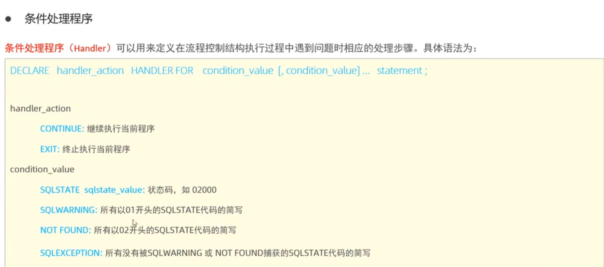

# 视图&存储过程篇

## 创建视图

语法如下：

```mysql
CREATE [OR REPLACE] VIEW view_name AS
SELECT column1, column2
FROM table_name
WHERE condition
[WITH [LOCAL | CASCADED] CHECK OPTION];
```

例如：

```mysql
create or replace view stu_v1 as select * from stu where age<=18;
```

> **OR REPLACE**：如果视图已存在，覆盖旧定义。
>
> **WITH CHECK OPTION**：确保通过视图的 **INSERT** 或 **UPDATE** 操作满足 **WHERE** 条件。
>
> **CASCADED**（默认）：检查当前视图及所有底层视图的 **WHERE** 条件。如果一个视图是基于另外一个视图创建，那么都会进行检查。

不满足条件的操作不会被执行。

**local：**它确保操作生成的行必须满足当前视图的 WHERE 条件，而不会检查底层视图的 WHERE 条件。

**MySQL视图不可更新的情况**

* 视图的SELECT语句中使用了聚合函数（count等）
* 包含GROUP BY子句
* 包含DISTINCT关键字
* 包含子查询
* 多表连接，union，having等

## 存储过程

存储过程相当于其他语言的**函数。**

MySQL中使用CREATE PROCEDURE语句创建存储过程

```sql
CREATE PROCEDURE procedure_name ([参数列表])
BEGIN
    -- SQL语句和逻辑
END;
```

调用

```mysql
CALL 名称(参数);
```

删除（drop procedure)

但是需要注意，语句可能包含多个‘；’导致执行提前结束，因此使用 `delimeter [分隔符]`，如 `$$`,我们就可以在最后加上这个分隔符。

## 变量

系统变量分为全局变量，会话变量(session)。


例如：

```sql
select @@stu.autocommit
```

@变量名 表示用户自定义的变量

例如：

```sql
SET@counter=@counter+1;
SET@counter:=@counter+1; -- 等价
```

查询这个变量：

SELECT @counter AS counter_value

（as后面的可以不写）

局部变量使用declare声明，在begin...end内,例如：

```sql
declare variation varchar(20);
```

**赋值**

* set
* select ... 字段 into ...变量名 from...表名

## 语句

**判断**：

if（条件）then     ...    ;

elseif(条件)then    ...      ;

else ...;

end if;

和高级语言差不多，就不多讲了。

**参数类型**

in/out/inout

* in作为输入，即传入一个值（函数参数）
* out作为输出，即函数的返回值（return）
* inout两者皆有

例如：

```sql
create procedure fun(inout sc int)
begin
set sc=sc*0.5;
end;
set @sc=70;
call fun(@sc);
select @sc;
```

**case**



相当于if-else，不多说。。。

**while**

语法：

while (表达式) do

内容

end while;

**repeat**

有条件的循环控制语句，满足条件退出循环。(相当于do-while循环)

repeat

内容

until 条件

end reprat;

**loop**

LOOP 是一个无条件循环，除非显式退出（如使用 LEAVE），否则会无限循环。

LEAVE：用于退出循环。(break)

ITERATE：跳过当前循环，进入下一次迭代。(continue)

```sql
[begin_label:] LOOP
    statement(s);
    [EXIT condition;] -- 或者使用 LEAVE 语句
END LOOP [end_label];
```

下面是一个函数，计算1-10的累加和

```sql
CREATE PROCEDURE SumNumbers()
BEGIN
    DECLARE counter INT DEFAULT 1;
    DECLARE total INT DEFAULT 0;
    my_loop: LOOP
        SET total = total + counter;
        SET counter = counter + 1;
        IF counter > 10 THEN
            LEAVE my_loop; -- 退出循环
        END IF;
    END LOOP my_loop;

    SELECT total AS result;
END 
CALL SumNumbers();

```

**cursor**

游标可以用来查询结果集，基本步骤包括：

* 声明游标：指定要遍历的查询。
* 打开游标：启动游标以准备读取数据。
* 读取数据：逐行获取数据并处理。
* 关闭游标：释放资源。

下面是一个基本操作的语法实例：

```sql
DECLARE cursor_name CURSOR FOR select_statement;-- 声明游标
OPEN cursor_name;-- 打开
loop_label: LOOP
    FETCH cursor_name INTO variable_list;-- 获取游标数据
    -- 处理逻辑
    IF done THEN
        LEAVE loop_label;
    END IF;-- 不一定只有if
END LOOP;
CLOSE cursor_name;-- 关闭
```

但是我们注意到，游标到达结果集末尾时，难以控制退出，因此引入 `HANDLER`。

（示例）

```sql
DECLARE EXIT HANDLER FOR SQLSTATE '02000' CLOSE CURSOR_name;
```

`SQLSTATE '02000'` 是一个标准的SQL状态码，表示“未找到”（`NOT FOUND`）的情况。在游标操作中，这通常意味着游标已经到达了数据集的末尾，没有更多的数据可以提取。

下面是一般的语法：



**存储函数**

存储函数是一个预定义的、可命名的程序块，存储在数据库中，接受输入参数，执行逻辑，并返回一个值。（只能是IN类型的参数）

```sql
CREATE FUNCTION function_name ([parameter_name parameter_type [, ...]])
RETURNS return_type
[DETERMINISTIC | NOT DETERMINISTIC]
BEGIN
    -- 声明变量
    DECLARE variable_name data_type;
    -- 逻辑代码
    -- 必须使用 RETURN 语句返回一个值
    RETURN value;
END 
```

**DETERMINISTIC**：表示相同输入总是产生相同输出。

下面是一个示例，创建一个函数，计算输入数字的平方：

```sql
CREATE FUNCTION Square(num INT)
RETURNS INT DETERMINISTIC
BEGIN
    DECLARE result INT;
    SET result = num * num;
    RETURN result;
END //
DELIMITER ;
-- 调用函数
SELECT Square(5) AS squared_value;
```

与存储过程相比，存储函数是封装返回单一值的可重用逻辑，适合嵌入 SQL 查询。
