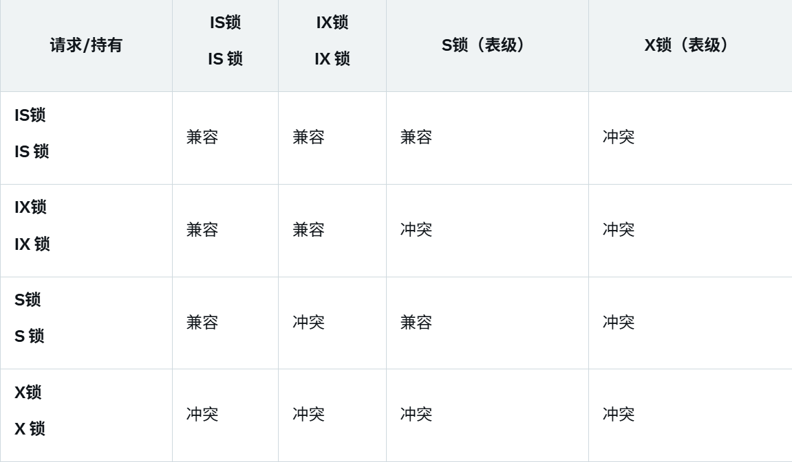

# 锁

## 全局锁/表级锁

FLUSH TABLES WITH READ LOCK是对数据库中的**所有表**施加全局读锁。（只读不写）

比较常见的应用是进行数据库备份，如：

```bash
mysqldump [options][database_name][table_name]> output_file.sql
mysqldump -u root -p mydb > mydb_backup.sql
```

需要注意的是，备份期间，主库不能随时更新，从库无法接受主库同步的二进制日志，导致主从延迟。

加上 `--single-transation`可以完成不加锁的备份。

---

**表锁**锁定整个表，适用于非事务存储引擎，并发性能较差，因为锁定整个表会限制其他事务的访问。

```sql
LOCK TABLES table_name READ;
UNLOCK TABLES;
```

read：**读锁**，限制写不限制读，又叫共享锁（S锁）

write：**写锁**，只有锁的持有者能够读写，其他的客户端均不允许读写。（也称为排他锁，X锁）

**元数据锁** ：用于保护表结构不被并发修改，自动应用于DDL操作（如ALTER TABLE）。

对一张表进行增删改查，加S锁，修改表结构，加X锁。

**意向锁**：表级锁，用于表示事务对表中某些行的锁请求意图，可以用来减少表锁的检查次数。可以分为：

意向共享锁 (IS)：由SELECT ... LOCK IN SHARE MODE触发。

意向排他锁 (IX)：由INSERT/UPDATE/DELETE/SELECT ... FOR UPDATE添加。

我们可以知道，意向锁之间的兼容性规则如下：



这个矩阵里面兼容的部分有点像一个箭头，可以用来辅助记忆（）

## 行级锁

行级锁是事务隔离性和并发控制的核心，适用于高并发场景。行级锁是通过对索引上面的索引项加锁实现的，不是加在记录上。（InnoDB引擎）

**行锁**：包括S锁和X锁，兼容性规则与上面的表相同。

注意，SELECT ... FOR UPDATE添加排他锁的时候，FOR UPDATE需要手动添加。

我们可以通过以下命令来查看锁：

```sql
SELECT * FROM information_schema.INNODB_LOCKS;
```

当使用唯一索引进行搜索时，如果记录已经存在，InnoDB会进行等值匹配。在这种情况下，InnoDB会自动优化为行锁。

如果查询不通过索引条件来检索数据，InnoDB将不得不对表中的所有记录加锁，这时就会升级为表锁。

因此索引是至关重要的（）

**间隙锁**：

间隙锁是InnoDB存储引擎锁定索引记录之间的“间隙”（Gap），防止其他事务在该间隙内插入新记录，主要用于防止幻读，在REPEATABLEREAD隔离级别下默认启用。

当在唯一索引上进行等值查询时，如果记录不存在，InnoDB会优化为间隙锁。

当在普通索引上进行等值查询时，如果向右遍历到最后一个值不满足查询需求，next-key锁会退化为间隙锁。

当在唯一索引上进行范围查询时，InnoDB会访问到不满足条件的第一个值为止。

举一个例子，数据id=1,3,5（那么间隙为(1, 3)和(3, 5)）。如果（1，3）被锁住，那么5仍然是可以被插入的。

---

等值查询是指SQL查询中使用等号（=）作为比较运算符，查找字段值与指定值完全相等的记录。

范围查询是指SQL查询中使用比较运算符或范围条件（如BETWEEN）来查找字段值在指定范围内的记录。

**下一键锁**

下一键锁是InnoDB存储引擎在索引上锁定一个记录（记录锁）以及该记录前面的间隙（间隙锁）的组合锁，锁定范围为**[prev_key, next_key)**，包括当前记录和前一个间隙。

主要目的是防止幻读，确保事务在范围查询中的一致性。

前面说到的下一键锁的退化机制，原因是等值查询只需要保护查询值所在的记录和可能的插入点（间隙），无需锁定不满足条件的记录。

范围查询会触发多种锁。
